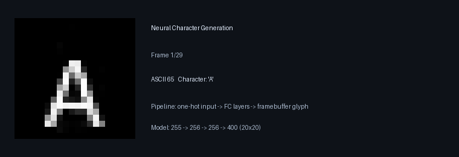
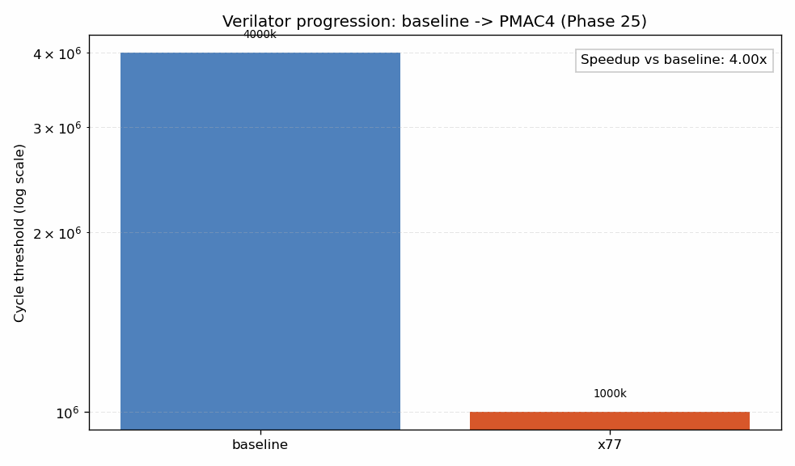

# ASE2026 — Neural-Driven Computing on a Minimal RISC-V Stack

> Advanced Systems Engineering (ASE2026), Paris Lodron University of Salzburg  
> Author: Bernhard Guillon

[](https://github.com/bernhard-guillon/ASE2026/actions/workflows/emulator-tests.yml)
[](https://github.com/bernhard-guillon/ASE2026/actions/workflows/build-pdf.yml)

[📄 Latest Paper PDF](https://github.com/bernhard-guillon/ASE2026/releases/download/ase2026-paper-latest/ase2026-latest.pdf)  
Fallback: [latest release notes](https://github.com/bernhard-guillon/ASE2026/releases/latest)

## Problem statement

Modern AI deployments are commonly embedded in large
software stacks. In contrast, this project investigates how far a
compact execution stack can be pushed when neural operations
are represented as first-class ISA extensions. The objective
is not to compete with full ML frameworks, but to design
and validate a minimal, inspectable path from trained model
weights to executable program behavior on a custom compute
substrate. We also want to research how far we can get rid of
a typical operating system and use "neural driven computing"
for interactive computing workloads.

## What this project builds

This repository implements an end-to-end neural execution toolchain:

1. Train a compact PyTorch character generator model.
2. Export weights to an intermediate JSON and compact binary format.
3. Compile model-driven programs with custom neural mnemonics.
4. Assemble with a Rust-based RISC-V assembler (`rv32as`) and GNU link flow.
5. Run on both a C++ emulator and a Verilator RTL backend.
6. Validate determinism and parity with automated differential tests.

The core optimization campaign iterates custom instructions (`x77`, `x7b`, PMAC variants) while preserving output behavior.

## Visuals

### Neural character generation (model output)



### Verilator speedup progression (baseline -> PMAC4)



## Benchmark highlight

From `documentation/collected-data/phase25-neural-lane-cycle-comparison.json`:

- Verilator baseline: `4,000,000` cycles
- PMAC4 (`x7b-8lane-pmac4`): `150,000` cycles
- Observed speedup vs baseline: **`26.67x`**

## Repository map

| Subproject | Path | Purpose |
| --- | --- | --- |
| Character generation | `projects/character-generation/` | Train and validate the PyTorch model (`255 -> 256 -> 256 -> 400`) |
| Game movement | `projects/game-movement/` | Train deterministic `20x20` player-movement transitions (`state + action -> next state`) |
| Weight export | `projects/weight-export/` | Convert PyTorch checkpoints into JSON + compact binary payloads |
| RV32 assembler | `projects/rv32_assembler/` | Assemble RV32I/RV32F + project neural custom instructions |
| Emulator + RTL flow | `projects/emulator/` | Execute binaries on C++ emulator and Verilator; run full validation |

## Quick start

### 1) Build and test emulator stack

```bash
cmake -S projects/emulator -B projects/emulator/build -DCMAKE_BUILD_TYPE=Release
cmake --build projects/emulator/build -j4
ctest --test-dir projects/emulator/build --output-on-failure
```

### 2) Train model (local)

```bash
cd projects/character-generation
python3 -m venv .venv
source .venv/bin/activate
pip install -r requirements.txt
cd src
python train.py 150 8
python inference.py
```

### 3) Export model payload

```bash
cd projects/weight-export
python3 export_generator.py
```

### 4) Run neural binary in Verilator backend

```bash
cd projects/emulator/build
./verilator_runner ./neural-op-enhance8pmac4.elf --char-code 65 --render-framebuffer
```

## Documentation

- Paper source: `documentation/ase2026.md`
- Consolidated project log: `documentation/project-log.md`
- Neural machine reference: `documentation/neural-risc-v-machine.md`
- Benchmark data: `documentation/collected-data/`

## Subproject READMEs

- [Character Generation](projects/character-generation/README.md)
- [Game Movement](projects/game-movement/README.md)
- [Weight Export](projects/weight-export/README.md)
- [RV32 Assembler](projects/rv32_assembler/README.md)
- [Emulator](projects/emulator/README.md)

## Re-generate README animations

```bash
python3 documentation/scripts/generate_readme_assets.py
```

## Next experiments (roadmap)

We now have a stable base (toolchain + parity + regression + Verilator differential) and can shift toward system-level experiments.

### 1) Interrupt-driven neural execution

Goal: introduce timer/input interrupts so neural workloads can react to events instead of running only in straight-line loops.

- Add minimal interrupt controller model in emulator + RTL.
- Define interrupt entry/return conventions for our runtime.
- Use interrupts to trigger neural update steps (e.g., frame tick, input event).

### 2) Single-player Neural Pong (squash mode)

Goal: prove interactive closed-loop behavior using the neural path in real time.

- One paddle, one wall bounce, increasing ball speed.
- Neural policy updates paddle movement from framebuffer/state input.
- Measure determinism and frame-cycle budgets on emulator vs Verilator.

#### Mockup (concept)

```text
+------------------------------------------------+
| SCORE: 07                                      |
|                                                |
|                         o  <- ball             |
|                                                |
|                                                |
|                                        |       |
|                                        |       |
|                                        |       |
|                                   PADDLE       |
|                                                |
| WALL (left)                                    |
+------------------------------------------------+
 Input IRQs -> game state update -> neural step -> paddle action
```

### 3) Dual-emulator networking

Goal: connect two emulator instances and exchange state/tokens each frame.

- Start with simple packet protocol over host sockets.
- Validate deterministic lockstep and desync handling.
- First target: multiplayer pong (left/right paddles, synchronized ball state).

### 4) Hardware I/O interface model

Goal: bridge neural inputs/outputs to realistic device semantics.

- Model char-device and MMIO/register style interfaces.
- Add a small driver boundary (SW driver in runtime, HW model in emulator/RTL).
- Map device events to neural input tensors and neural outputs back to actuator registers/framebuffer.

These items define the next phase toward interactive, multi-agent, hardware-facing neural systems.
