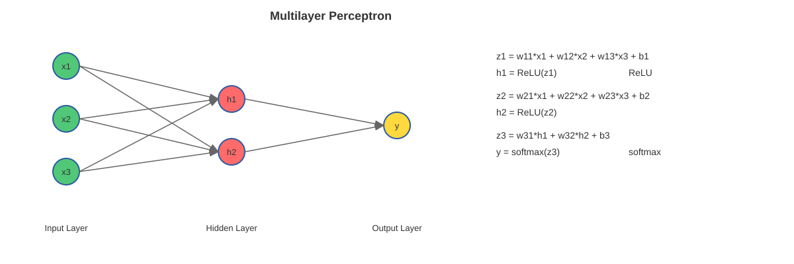

# Neural-Driven Computing

Advanced Systems Engineering (ASE2026)
Paris Lodron University of Salzburg
Author: Bernhard Guillon
Date: 2026-04-29

---

# Research topics

* Have you ever wondered why we need a full stack of Operating System and a Browser to run AI workloads?
* Can't we just use LLMs to create "runnable" perceptrons instead of writing tons of code with it?
* Is it possible to use Perceptron-based computing as an operating system?

---

# Where we come from

* 1940s-1950s: Punch Cards & Batch Processing
* 1960s: Mainframe OS & Time-Sharing
* 1970s-1980s: Personal Computers & GUIs - CP/M (1974) for microcomputers. 
* 1990s: Windows & Linux - (GUI and multitasking)
* 2000s-2010s: Mobile OS with Browsers
* 2020s-now: AI all over but not for Operating Systems

---

# What an operating system does

* Abstracts the hardware
* Memory management
* I/O handling
* Allows multiple processes
* Multiple users
* Tries hard to separate processes and users from each other

---

# What a multilayer network does



---

# Approach

* RISC-V + Tensor OPs                                                                  [✓] 
* Emulator + RTL (system verilog)                                                      [✓]
* Assembler for the extensions                                                         [✓]
* Minimalistic bootloader                                                              [✓]
* Pytorch for training                                                                 [✓]
* A "transpiler" for loadable and runnable artifact out of the trained network         [✓]

---
## Simple character input [0..255] to framebuffer [20x20] output
```

                    
                    
                    
                    
                    
                    
                    
         ##         
        ###         
        # ##        
                    
       ##           
       #    #       
       #   ##       
      # ### #       
      ##    ##      
     ##     ##      
     ##      ##     
                    

```

---
## Moveable character from [h,j,k,l] input in a [20x20] framebuffer
```
                    
                    
                    
                    
                    
                    
                    
                    
                    
      #             
                    
                    
                    
                    
                    
                    
                    
                    
                    

```
---
# Future work - squash mockup
```
+------------------------------------------------+
| SCORE: 07                                      |
|                                                |
|                         o  <- ball             |
|                                                |
|                                                |
|                                        |       |
|                                        |       |
|                                        |       |
|                                   PADDLE       |
|                                                |
| WALL (left)                                    |
+------------------------------------------------+
```

---

# Future work - pong over network

* Dual-emulator networking
* connect two emulator instances and exchange state/tokens each frame.
* multiplayer pong (left/right paddles, synchronized ball state).

---

# Thank you

Thanks for your attention I hope you've enjoyed the presentation!
Feel free to ask me anything.
---
