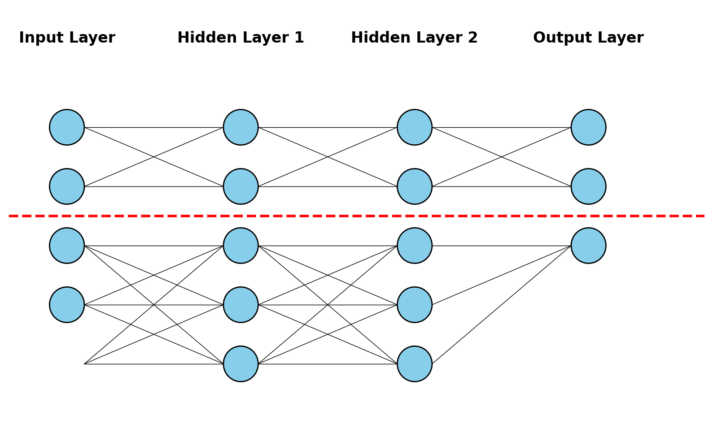

# Neural Inference as the Operating System on Minimal RISC-V

Advanced Systems Engineering (ASE2026)

Paris Lodron University of Salzburg

Author: Bernhard Guillon

Date: 2026-06-24

---

# Problem definition

* Can a minmal system use neural inference as its primary computation model, replacing traditional OS and applictaion code?

---

# What an operating system does

* Abstracts the hardware
* Memory management
* I/O handling
* Allows multiple processes
* Multiple users
* Tries hard to separate processes and users from each other


---

# Approach

* RISC-V + Tensor OPs
* Emulator + RTL (system verilog)
* Assembler for the extensions
* Minimalistic bootloader/runner
* Pytorch for training
* A toolchain to create runable networks

---

# Divide and conquer



---

# Toolchain

* describe the problem
* subdevide the networks
* train the networks
* create combinded model

---

# Parallel vs time sliced execution

```
+----------------------+             +----------------------+
|                      |             | #################### |
|                      |             | #                  # |
|                      |             | #                  # |
|                      |             | ####               # |
|                      |             | ####            ## # |
|                      |             | ####            ## # |
|                      |             | ####               # |
|                      |             | ####               # |
|        ####          |             | #                  # |
|        #   #         | <==========>| #                  # |
|                      | Tab, ESC, \ | #                  # |
|                      | <==========>| #                  # |
|        ######        |             | #                  # |
|       ##    #        |             | #                  # |
|       ##             |             | #################### |
|       ##  ###        |             |       ##    #        |
|          #  #        |             |       ##             |
|                      |             |       ##  ###        |
|                      |             |          #  #        |
|                      |             |                      |
+----------------------+             +----------------------+
```

---

# Findings

* Combination of MLPs
* I/O handling
* Parallel vs time sliced execution
* Virtual Hardware
* limited process and memory isolation

---

# So long, and thanks for all the fish

* Thank you for your attention
* Feel free to ask me anything
