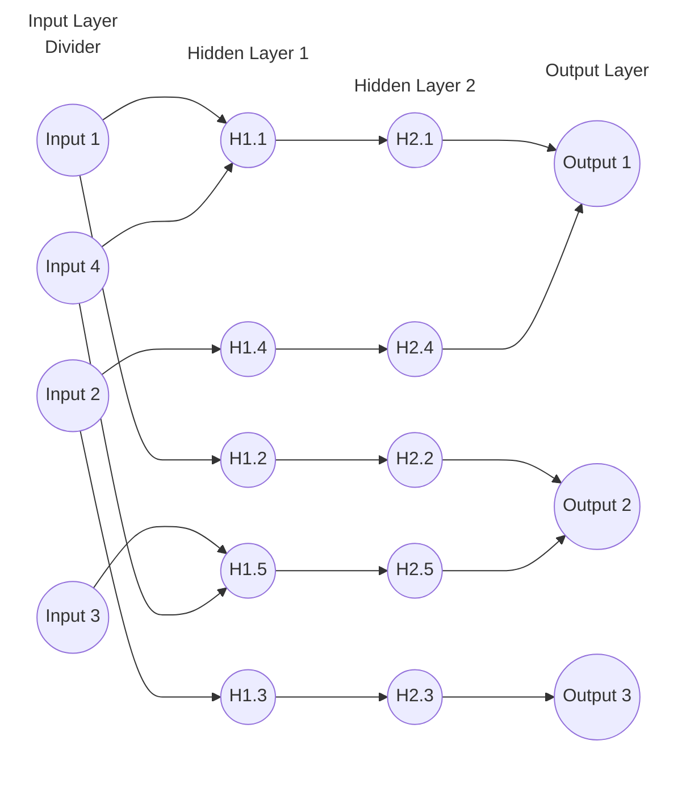

---
header-includes:
  - \usepackage{tikz}
  - \usetikzlibrary{positioning, fit, shapes.geometric}
---

The insight is the product

---


---

# Hello

* World

# This

* is a tets

# Math Example

The quadratic formula:

$$ x = \frac{-b \pm \sqrt{b^2 - 4ac}}{2a} $$

Inline example: $E = mc^2$

# MLP

```{=latex}
\begin{tikzpicture}[scale=0.6, transform shape,
    neuron/.style={circle, draw, minimum size=0.6cm, inner sep=0pt},
    layer/.style={text width=1.2cm, align=center, font=\footnotesize},
    divider/.style={draw=none, fill=none, text height=0.4cm, text depth=0.4cm},
    >=stealth,
    node distance=0.5cm and 1cm,
    every edge/.style={->, draw}
]

    % Input Layer
    \node[neuron] (I1) {Input 1};
    \node[neuron, below=of I1] (I2) {Input 2};
    \node[divider, below=0.5cm of I2] (divider) {};
    \node[neuron, below=0.5cm of divider] (I3) {Input 3};
    \node[neuron, below=of I3] (I4) {Input 4};

    % Hidden Layer 1
    \node[neuron, right=2cm of I1] (H11) {H1.1};
    \node[neuron, below=of H11] (H12) {H1.2};
    \node[neuron, below=of H12] (H13) {H1.3};
    \node[neuron, below=of H13] (H14) {H1.4};
    \node[neuron, below=of H14] (H15) {H1.5};

    % Hidden Layer 2
    \node[neuron, right=2cm of H11] (H21) {H2.1};
    \node[neuron, below=of H21] (H22) {H2.2};
    \node[neuron, below=of H22] (H23) {H2.3};
    \node[neuron, below=of H23] (H24) {H2.4};
    \node[neuron, below=of H24] (H25) {H2.5};

    % Output Layer
    \node[neuron, right=2cm of H21] (O1) {Output 1};
    \node[neuron, below=of O1] (O2) {Output 2};
    \node[neuron, below=of O2] (O3) {Output 3};

    % Divider line (horizontal)
    \draw[dashed, thick] ([xshift=-1cm, yshift=0.25cm]divider.west) -- ([xshift=1cm, yshift=0.25cm]divider.east);

    % Connections for Input 1 and Input 2 (above the line)
    \draw[->] (I1) -- (H11);
    \draw[->] (I1) -- (H12);
    \draw[->] (I2) -- (H13);
    \draw[->] (I2) -- (H14);

    % Connections for Input 3 and Input 4 (below the line)
    \draw[->] (I3) -- (H15);
    \draw[->] (I4) -- (H11);
    \draw[->] (I4) -- (H15);

    % Connections from Hidden Layer 1 to Hidden Layer 2
    \draw[->] (H11) -- (H21);
    \draw[->] (H12) -- (H22);
    \draw[->] (H13) -- (H23);
    \draw[->] (H14) -- (H24);
    \draw[->] (H15) -- (H25);

    % Connections from Hidden Layer 2 to Output Layer
    \draw[->] (H21) -- (O1);
    \draw[->] (H22) -- (O2);
    \draw[->] (H23) -- (O3);
    \draw[->] (H24) -- (O1);
    \draw[->] (H25) -- (O2);

    % Layer labels
    \node[layer, above=0.4cm of I1] {Input Layer};
    \node[layer, above=0.4cm of H11] {Hidden Layer 1};
    \node[layer, above=0.4cm of H21] {Hidden Layer 2};
    \node[layer, above=0.4cm of O1] {Output Layer};

\end{tikzpicture}
```

# Diagram


